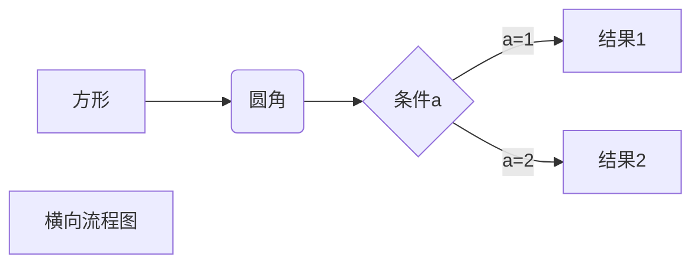
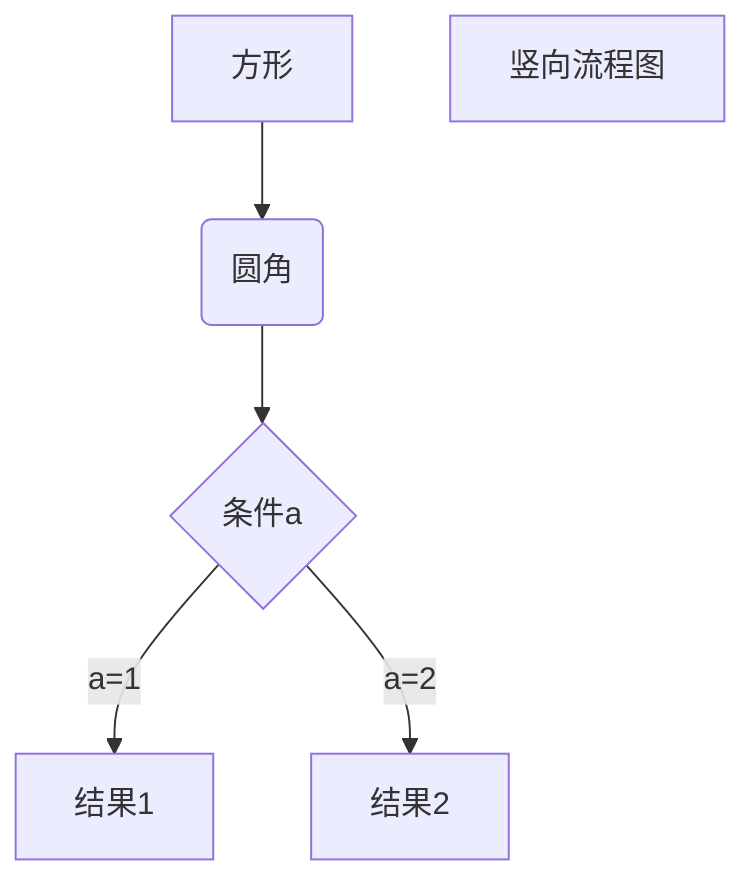
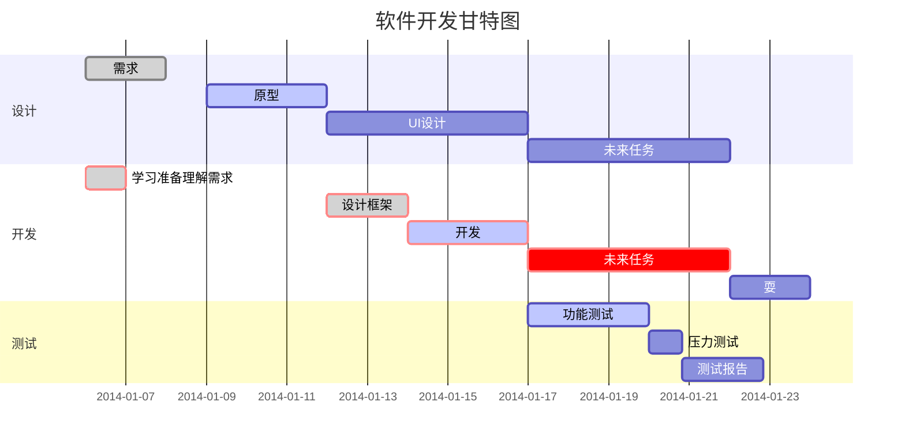

# 基本语法


##几级标题怎么写
'# 一级标题'
'## 二级标题'
'### 三级标题'

##文体
*斜体文本*
_斜体文本_

**粗体文本**
__粗体文本__
***粗斜体文本***
___粗斜体文本___
_比如_
__比如__
___比如___

##分隔线
你可以在一行中用三个以上的星号、减号、底线来建立一个分隔线，行内不能有其他东西。你也可以在星号或是减号中间插入空格。下面每种写法都可以建立分隔线：
***

* * *

*****

- - -

---
##删除线
如果段落上的文字要添加删除线，只需要在文字的两端加上两个波浪线 ~~ 即可，实例如下：

RUNOOB.COM
GOOGLE.COM
~~BAIDU.COM~~
##下划线
下划线可以通过 HTML 的 标签来实现
<u>带下划线文本</u>ssa1
begain--------end


##脚注
脚注是对文本的补充说明。
Markdown 脚注的格式如下:
创建脚注格式类似这样 [^RUNOOB]。
[^RUNOOB]: 菜鸟教程 -- 学的不仅是技术，更是梦想！！！


##Markdown 列表
Markdown 支持有序列表和无序列表。

无序列表使用星号(*)、加号(+)或是减号(-)作为列表标记，这些标记后面要添加一个空格，然后再填写内容


- 第一项
- 第二项
- 第三项
1. 第一项
2. 第二项
3. 第三项
###列表嵌套
列表嵌套只需在子列表中的选项前面添加两个或四个空格（一个tab）即可：
1. 第一项：
    - 第一项嵌套的第一个元素
    - 第一项嵌套的第二个元素
2. 第二项：
    - 第二项嵌套的第一个元素
    - 第二项嵌套的第二个元素
##Markdown 区块
> 区块引用
> 菜鸟教程
> 学的不仅是技术更是梦想


> 最外层
> > 第一层嵌套
> > > 第二层嵌套

- 第一项 
    > 菜鸟教程
    > 学的不仅是技术更是梦想
* 第二项
##Markdown 代码
`printf()` 函数
`list()`函数 
``是反引号，通过波浪号-英文环境打出
```javascript
$(document).ready(function () {
    alert('RUNOOB');
});
```
##Markdown 流程图


-----------------------



-----------------
```sequence
对象A->对象B: 对象B你好吗?（请求）
Note right of 对象B: 对象B的描述
Note left of 对象A: 对象A的描述(提示)
对象B-->对象A: 我很好(响应)
对象A->对象B: 你真的好吗？
```
---------------
```sequence
Title: 标题：复杂使用
对象A->对象B: 对象B你好吗?（请求）
Note right of 对象B: 对象B的描述
Note left of 对象A: 对象A的描述(提示)
对象B-->对象A: 我很好(响应)
对象B->小三: 你好吗
小三-->>对象A: 对象B找我了
对象A->对象B: 你真的好吗？
Note over 小三,对象B: 我们是朋友
participant C
Note right of C: 没人陪我玩
```
-------------

##其他参考另见[制图制表参考](https://www.runoob.com/markdown/md-advance.html)